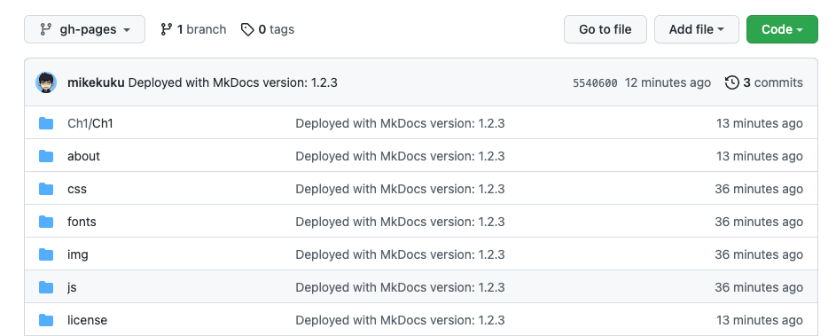

# Kuku-About

## Here testing

---
**NOTE**

It works with almost all markdown flavours (the below blank line matters).

---

!!! info inline end

    Lorem ipsum dolor sit amet, consectetur
    adipiscing elit. Nulla et euismod nulla.
    Curabitur feugiat, tortor non consequat
    finibus, justo purus auctor massa, nec
    semper lorem quam in massa.

This file is under /docs folder.

[Setup MKDocs in Mac](https://suedbroecker.net/2021/01/25/how-to-install-mkdocs-on-mac-and-setup-the-integration-to-github-pages/)

My github path
[the site](https://github.com/mikekuku/MKDoc)

Note: 
the basic concept will be use "mkdocs gh-deploy" to generate the docs

!!! tip
    [Dark or Light](https://squidfunk.github.io/mkdocs-material/setup/changing-the-colors/?h=dark#system-preference)

## Demo2
Error?

### Abbrivation
The HTML specification is maintained by the W3C.

*[HTML]: Hyper Text Markup Language
*[W3C]: World Wide Web Consortium

### Test List
- [x] Lorem ipsum dolor sit amet, consectetur adipiscing elit
- [ ] Vestibulum convallis sit amet nisi a tincidunt
    * [x] In hac habitasse platea dictumst
    * [x] In scelerisque nibh non dolor mollis congue sed et metus
    * [ ] Praesent sed risus massa
- [ ] Aenean pretium efficitur erat, donec pharetra, ligula non scelerisque
